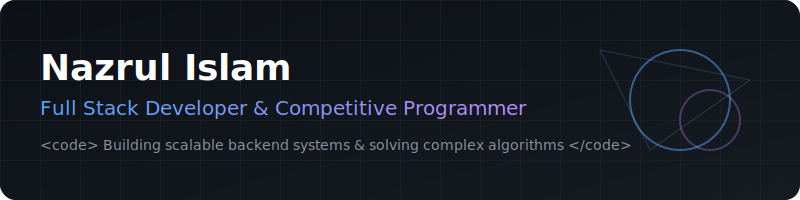

  <picture>
    <source media="(prefers-color-scheme: dark)" srcset="./assets/images/banner-dark.svg">
    <source media="(prefers-color-scheme: light)" srcset="./assets/images/banner-light.svg">
    
  </picture>

  <h1>Hi 👋, I'm Nazrul Islam</h1>

  

   

  <!-- Clean Contact Badges -->
  
  
  
   
  ⭐ If you like my projects, consider giving them a star.

---

## 🚀 About Me

I am a passionate **Full-Stack Developer** and **Competitive Programmer** driven by algorithms and elegant system design. I bridge the gap between complex backend architectures and seamless user experiences.

- 🔭 **Currently working on:** [BetterCF](https://github.com/mhdnazrul/BetterCF) (Chrome Extension for Codeforces)
- 🌱 **Currently learning:** Advanced `C#`, `.NET`, `Next.js`, and `IoT Integration`
- 🎯 **Focus:** System Design, Algorithm Optimization, and Clean Code
- 📫 **Reach me:** [mhdnazrulislam.com](https://nazrul-dev.vercel.app/) | [Resume](https://drive.google.com/drive/folders/14cFhmLg6xP1itEozI6ePPj0oHbRUHCYa?usp=sharing)

---

## 🏆 Competitive Programming

As a competitive programmer, I continuously refine my algorithmic problem-solving skills. 

  <table width="100%">
    <tr>
      <td align="center" width="50%" valign="top">
        <b>LeetCode</b> 
        
      </td>
      <td align="center" width="50%" valign="top">
        <b>Codeforces</b> 
        <table width="100%">
          <tr>
            <td>Username</td>
            <td align="right"><b><!-- CF_USERNAME -->nazrulislam_7<!-- CF_USERNAME_END --></b></td>
          </tr>
          <tr>
            <td>Rank</td>
            <td align="right"><b><!-- CF_RANK -->Newbie<!-- CF_RANK_END --></b></td>
          </tr>
          <tr>
            <td>Current Rating</td>
            <td align="right"><b><!-- CF_CURRENT_RATING -->1108<!-- CF_CURRENT_RATING_END --></b></td>
          </tr>
          <tr>
            <td>Maximum Rating</td>
            <td align="right"><b><!-- CF_MAX_RATING -->1207<!-- CF_MAX_RATING_END --></b></td>
          </tr>
          <tr>
            <td>Solved</td>
            <td align="right"><b><!-- CF_SOLVED -->N/A<!-- CF_SOLVED_END --> Problems</b></td>
          </tr>
          <tr>
            <td colspan="2" align="center"> <a href="https://codeforces.com/profile/nazrulislam_7">View Profile →</a></td>
          </tr>
        </table>
      </td>
    </tr>
    <tr>
      <td align="center" width="50%" valign="top">
        <b>CodeChef</b> 
        <table width="100%">
          <tr>
            <td>Username</td>
            <td align="right"><b><!-- CC_USERNAME -->nazrulislam_7<!-- CC_USERNAME_END --></b></td>
          </tr>
          <tr>
            <td>Stars</td>
            <td align="right"><b><!-- CC_STARS -->N/A<!-- CC_STARS_END --></b></td>
          </tr>
          <tr>
            <td>Highest Rating</td>
            <td align="right"><b><!-- CC_MAX_RATING -->1423<!-- CC_MAX_RATING_END --></b></td>
          </tr>
          <tr>
            <td>Solved</td>
            <td align="right"><b><!-- CC_SOLVED -->N/A<!-- CC_SOLVED_END --> Problems</b></td>
          </tr>
          <tr>
            <td colspan="2" align="center"> <a href="https://www.codechef.com/users/nazrulislam_7">View Profile →</a></td>
          </tr>
        </table>
      </td>
      <td align="center" width="50%" valign="top">
        <b>AtCoder</b> 
        <table width="100%">
          <tr>
            <td>Username</td>
            <td align="right"><b><!-- AC_USERNAME -->nazrulislam_7<!-- AC_USERNAME_END --></b></td>
          </tr>
          <tr>
            <td>Rank Color</td>
            <td align="right"><b><!-- AC_RANK -->52543rd (Top 40.97%)<!-- AC_RANK_END --></b></td>
          </tr>
          <tr>
            <td>Current Rating</td>
            <td align="right"><b><!-- AC_RATING -->N/A<!-- AC_RATING_END --></b></td>
          </tr>
          <tr>
            <td>Highest Rating</td>
            <td align="right"><b><!-- AC_MAX_RATING -->N/A<!-- AC_MAX_RATING_END --></b></td>
          </tr>
          <tr>
            <td colspan="2" align="center"> <a href="https://atcoder.jp/users/nazrulislam_7">View Profile →</a></td>
          </tr>
        </table>
      </td>
    </tr>
  </table>

---

## 🛠️ Tech Stack

| 💻 Languages | 🎨 Frontend & Design | ⚙️ Backend & DB |
| :---: | :---: | :---: |
|  |  |  |

 

| 🐧 OS & Tools | 📱 Mobile & IoT | 🚀 Others |
| :---: | :---: | :---: |
|  |  |  |

---

## 📈 Developer Dashboard

  <table>
    <tr>
      <td width="50%">
        
      </td>
      <td width="50%">
        
      </td>
    </tr>
  </table>
   
  

  <!-- Contribution Grid Snake -->
  <picture>
    <source media="(prefers-color-scheme: dark)" srcset="https://raw.githubusercontent.com/mhdnazrul/mhdnazrul/output/github-contribution-grid-snake-dark.svg">
    <source media="(prefers-color-scheme: light)" srcset="https://raw.githubusercontent.com/mhdnazrul/mhdnazrul/output/github-contribution-grid-snake.svg">
    
  </picture>

---

## 🚀 Featured Projects & Expertise

**[BetterCF](https://github.com/mhdnazrul/BetterCF)**
*Creator & Maintainer* | An open-source extension for Codeforces to improve competitive programming UX.

**Key Expertise & Past Work:**
- **Shopfinity:** Scalable full-stack e-commerce platform built with React & Node.js (Lead Developer).
- **EasyChat:** Real-time chat application with WebSocket integration (Creator).
- **Hex Strategy Game:** Interactive AI vs. Human strategy board game (Python / AI).
- **winutil:** Chris Titus Tech's Windows Utility(Contributor).

---

## 📜 License

This repository's architecture and automation scripts are open-sourced under the [MIT License](LICENSE).

---

## ⚡ Live Developer Dashboard

### ⏱ Weekly Coding Activity

<!--START_SECTION:waka-->
Updating automatically...
<!--END_SECTION:waka-->

### 🌟 Recent GitHub Activity

<!--START_SECTION:activity-->
Updating automatically...
<!--END_SECTION:activity-->

### 📅 Last Updated

<!-- LAST_UPDATED --><i>Last updated: July 23, 2026 at 19:23 UTC</i><!-- LAST_UPDATED_END -->

---

Thank you for visiting my profile! ❤️

If you find my projects useful, consider giving them a ⭐.

Happy Coding 🚀

