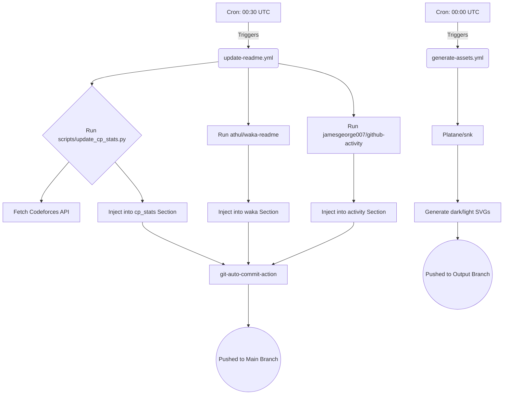

# Repository Documentation & Maintenance Guide

Welcome to the definitive guide for understanding, extending, and maintaining this GitHub Profile repository. 

This architecture was explicitly designed to separate the presentation layer (Markdown/HTML) from the data layer (Python scripts) and the automation layer (GitHub Actions), resulting in a zero-maintenance, highly scalable developer dashboard.

---

## 1. Repository Architecture
The repository operates as a fully automated static site. Instead of manually editing the `README.md` to reflect new statistics or coding activity, GitHub Actions are used as cron-triggered chron-jobs. These actions execute Python scripts and third-party integrations to fetch live data (Codeforces API, WakaTime, GitHub API) and securely inject it back into the `README.md` using isolated HTML/Markdown placeholder tags (`<!-- START_SECTION:section_name -->`).

## 2. Folder Structure
```text
mhdnazrul/
├── .github/
│   ├── workflows/        # GitHub Actions CI/CD pipelines
│   ├── ISSUE_TEMPLATE/   # Issue formats
│   ├── dependabot.yml    # Auto-dependency updates
│   └── PULL_REQUEST_TEMPLATE.md
├── assets/
│   ├── branding/         # Brand identity guidelines
│   ├── icons/            # SVG icons
│   ├── images/           # Core banners
│   └── screenshots/      # Project previews
├── docs/                 # Repository documentation (You are here)
├── scripts/              # Automation backend (Python)
├── LICENSE               # Open-source MIT license
├── PROJECT_STRUCTURE.md  # High-level structure overview
└── README.md             # The main profile dashboard
```

## 3. Purpose of Every Folder
- **`.github/`**: The brain of the automation. It houses the workflows that execute on a schedule to fetch data and commit updates.
- **`assets/`**: The visual hub. This folder isolates heavy image files, preventing the root directory from becoming cluttered.
- **`docs/`**: The knowledge base. Stores internal guides for developers contributing to or forking the repository architecture.
- **`scripts/`**: The logic layer. Contains all custom backend code used to scrape, fetch, and format dynamic data before it is injected into the README.

## 4. Purpose of Every GitHub Action
| Action File | Trigger | Purpose |
| :--- | :--- | :--- |
| `generate-assets.yml` | `00:00 UTC` | Generates the dark/light mode Contribution Snake animation and securely pushes it to an isolated `output` branch. |
| `update-readme.yml` | `00:30 UTC` | The primary data pipeline. Runs the Python CP scripts, fetches WakaTime metrics, pulls Recent Activity, and auto-commits all changes directly to the `main` branch. |
| `health-check.yml` | `Sundays` | Runs the CI health suite. Executes Lychee (link checker), CSpell (typos), Markdown linting, and Actionlint to ensure repository stability. |

## 5. Purpose of Every Python Script
| Script File | Purpose |
| :--- | :--- |
| `update_cp_stats.py` | Connects to the Codeforces API, fetches live rating and rank data for the specified handle, and coordinates the injection process. Also generates a localized `last_updated` timestamp. |
| `readme_formatter.py` | A utility module containing strict Regex rules (`re.DOTALL`). It safely opens the `README.md`, targets specific `START/END` section tags, and replaces the content without corrupting surrounding layout. |

---

## 6. Automation Flow Diagram



---

## 7. How the README Updates Automatically
The `README.md` is populated with HTML-style comment tags (e.g., `<!-- START_SECTION:cp_stats -->`). The GitHub Action spins up an Ubuntu runner, checks out the code, executes the Python scripts to fetch the data, replaces the text specifically between those tags, and finally uses `stefanzweifel/git-auto-commit-action` to detect file differences and push the changes back to your repository.

## 8. Required GitHub Secrets
To ensure this architecture functions correctly, you must navigate to **Settings > Secrets and variables > Actions** and ensure the following are configured:
1. `WAKATIME_API_KEY`: Required for the WakaTime stats workflow.
2. `GITHUB_TOKEN`: This is automatically provided by GitHub Actions for committing files, but must have `contents: write` permissions explicitly granted in the workflow jobs.

---

## 9. How to Add a New Project
1. Open `README.md`.
2. Locate the `## 🚀 Featured Projects & Expertise` section.
3. Append a new list item following the established format:
   `- **Project Name:** Description of project (Role).`
4. If linking a repository, use standard Markdown formatting: `[Project Name](https://github.com/...)`.

## 10. How to Update Competitive Programming Stats
The system handles fetching the data automatically. However, if your Codeforces handle changes:
1. Open `scripts/update_cp_stats.py`.
2. Locate the default fallback on line 24: `CF_HANDLE = os.getenv("CF_HANDLE", "your_new_handle")`.
3. Commit the file. The workflow will pull data for the new handle on its next run.

## 11. How to Troubleshoot Workflows
If a workflow fails:
1. Go to the **Actions** tab on your GitHub repository.
2. Click on the failed workflow run (marked with a red ❌).
3. Expand the specific step that failed.
4. **Common Issues:** 
   - *API rate limiting:* (Wait an hour and re-run). 
   - *Missing Secret:* Ensure `WAKATIME_API_KEY` is valid.
   - *Cloudflare Block:* The Codeforces API occasionally blocks GitHub IPs. The script is configured to safely skip the update and try again tomorrow.

## 12. How to Regenerate Assets
If you need the Contribution Snake to update immediately (instead of waiting for the cron schedule):
1. Go to the **Actions** tab.
2. Select **Generate Assets** on the left menu.
3. Click **Run workflow**.

## 13. How to Run Everything Locally
If you are developing or testing the Python scripts locally on your machine:
1. Ensure Python 3.10+ is installed.
2. Clone the repository.
3. Open a terminal in the repository root.
4. Run the script: `python scripts/update_cp_stats.py`
5. Check your local `README.md` to confirm the injection was successful before committing.
